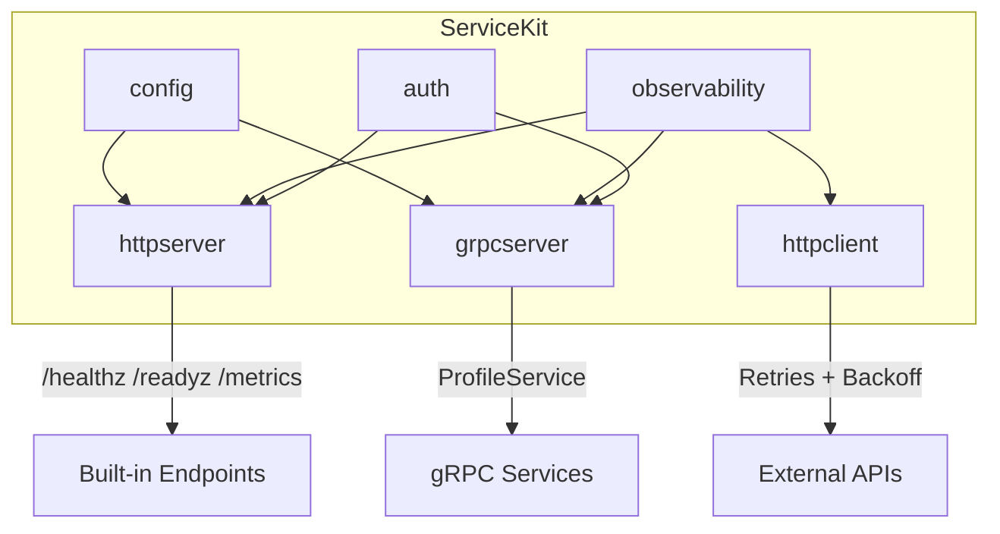

# ServiceKit

[](https://github.com/aalindkale/servicekit/actions/workflows/ci.yml)
[](https://pkg.go.dev/github.com/aalindkale/servicekit)
[](https://goreportcard.com/report/github.com/aalindkale/servicekit)

A reusable Go package that lets you start a secure, observable HTTP or gRPC service with sensible defaults.

ServiceKit provides typed configuration, HTTP and gRPC server setup, authentication hooks, structured logging, OpenTelemetry tracing, Prometheus metrics, graceful shutdown, and a context-aware HTTP client — all behind a small, composable API.

---

## Quick Start

### Install

```bash
go get github.com/aalindkale/servicekit@latest
```

### Prerequisites

- Go 1.22+
- (Optional) `protoc` with `protoc-gen-go` and `protoc-gen-go-grpc` for regenerating proto code

```bash
# Install development tools (protoc plugins + linter)
make tools

# Generate protobuf Go code (if you modify profile.proto)
make generate
```

### Configure

Set environment variables (all optional — sensible defaults are provided):

```bash
export SERVICEKIT_PORT=8080              # HTTP server port (default: 8080)
export SERVICEKIT_GRPC_PORT=9090         # gRPC server port (default: 9090)
export SERVICEKIT_METRICS_PORT=9091      # Prometheus metrics port (default: 9091)
export SERVICEKIT_SHUTDOWN_TIMEOUT=15s   # Graceful shutdown timeout (default: 15s)
export SERVICEKIT_LOG_LEVEL=info         # Log level: debug|info|warn|error (default: info)
export SERVICEKIT_AUTH_TOKEN=my-secret   # Bearer token for authentication
```

### Run

```go
package main

import (
    "log"
    "net/http"

    "github.com/aalindkale/servicekit/config"
    "github.com/aalindkale/servicekit/httpserver"
    "github.com/aalindkale/servicekit/observability"
)

func main() {
    // Load and validate configuration
    cfg, err := config.Load()
    if err != nil {
        log.Fatal(err)
    }

    // Initialize structured logger
    logger, err := observability.NewLogger(cfg.LogLevel)
    if err != nil {
        log.Fatal(err)
    }
    defer logger.Sync()

    // Create and start HTTP server with defaults
    srv, err := httpserver.New(cfg, logger)
    if err != nil {
        log.Fatal(err)
    }

    srv.HandleFunc("GET /hello", func(w http.ResponseWriter, r *http.Request) {
        w.Write([]byte("Hello, ServiceKit!"))
    })

    if err := srv.ListenAndServe(); err != nil {
        logger.Fatal("server stopped", zap.Error(err))
    }
}
```

Out of the box you get:
- `GET /healthz` — liveness probe (always `200 OK`)
- `GET /readyz` — readiness probe (`200` or `503`)
- `GET /metrics` — Prometheus scrape endpoint
- Structured JSON logging with request IDs
- Panic recovery
- Request size limits
- Graceful shutdown on `SIGINT`/`SIGTERM`

---

## Architecture



---

## Packages

### `config` — Typed Configuration

Loads from environment variables with safe defaults and validation. Secret values (like `AuthToken`) are redacted in `String()` output.

```go
cfg, err := config.Load()
fmt.Println(cfg)
// Config{Port:8080 ShutdownTimeout:15s LogLevel:info AuthToken:[REDACTED] GRPCPort:9090 MetricsPort:9091}
```

| Variable | Default | Description |
|---|---|---|
| `SERVICEKIT_PORT` | `8080` | HTTP server port |
| `SERVICEKIT_GRPC_PORT` | `9090` | gRPC server port |
| `SERVICEKIT_METRICS_PORT` | `9091` | Prometheus metrics port |
| `SERVICEKIT_SHUTDOWN_TIMEOUT` | `15s` | Graceful shutdown timeout |
| `SERVICEKIT_LOG_LEVEL` | `info` | Minimum log level |
| `SERVICEKIT_AUTH_TOKEN` | *(empty)* | Bearer token for auth |

### `observability` — Logging, Metrics & Tracing

**Structured logging** via [zap](https://github.com/uber-go/zap):

```go
logger, _ := observability.NewLogger("info")
logger.Info("request handled", zap.String("method", "GET"), zap.Int("status", 200))
```

**Prometheus metrics** with standard HTTP and gRPC collectors:

```go
metrics := observability.NewMetrics(nil) // uses default registerer
// metrics.HTTPRequestsTotal, metrics.HTTPRequestDuration, etc.
```

**OpenTelemetry tracing** with stdout exporter for development:

```go
tp, _ := observability.InitTracer("my-service")
defer observability.ShutdownTracer(context.Background(), tp)
```

### `auth` — Authentication & Authorization

Token-based authentication with a clean interface:

```go
// Use StaticValidator for simple token validation
validator := auth.NewStaticValidator("my-secret-token")

// Or MockValidator for testing
validator := auth.NewMockValidator(auth.Identity{Subject: "user-1", Roles: []string{"admin"}}, nil)

// HTTP middleware
mux.Handle("/api/", auth.HTTPMiddleware(validator)(apiHandler))

// Role-based authorization
mux.Handle("/admin/", auth.RequireRole("admin")(adminHandler))
```

### `httpserver` — HTTP Server

Production-ready HTTP server with middleware chain:

```go
srv, _ := httpserver.New(cfg, logger,
    httpserver.WithMetrics(metrics),
    httpserver.WithReadyCheck(func() bool { return dbReady }),
    httpserver.WithMaxBodySize(5 << 20), // 5MB
)

srv.Handle("POST /api/data", auth.HTTPMiddleware(validator)(dataHandler))

srv.ListenAndServe() // blocks until SIGINT/SIGTERM
```

Default middleware chain (applied automatically):
1. **Recovery** — catches panics, returns 500
2. **Request ID** — generates/propagates `X-Request-ID`
3. **Logging** — structured request logging (headers redacted)
4. **Metrics** — Prometheus counters and histograms
5. **Body limit** — `MaxBytesReader` (default 1MB)

### `httpclient` — HTTP Client

Context-aware HTTP client with retries:

```go
client := httpclient.New(
    httpclient.WithTimeout(10 * time.Second),
    httpclient.WithLogger(logger),
)

resp, err := client.Get(ctx, "https://api.example.com/data")
```

Retry behavior:
- **Exponential backoff** with configurable jitter
- **Safe by default**: only retries idempotent methods (GET, HEAD, PUT, DELETE, OPTIONS)
- **Retryable errors**: network errors, HTTP 429/502/503/504
- **Respects `Retry-After`** header on 429 responses
- **Context-aware**: cancelled contexts abort retries immediately

### `grpcserver` — gRPC Server

gRPC server with interceptor chain:

```go
grpcSrv, _ := grpcserver.New(cfg, logger, validator, metrics)

profilev1.RegisterProfileServiceServer(grpcSrv.Server(), grpcserver.NewProfileServer())

grpcSrv.Serve() // blocks until stopped
```

Interceptor chain: Recovery → Logging → Metrics → Tracing → Auth

---

## Example

See [`example/main.go`](example/main.go) for a complete, runnable example that wires up both HTTP and gRPC servers with all observability and auth features.

```bash
SERVICEKIT_AUTH_TOKEN=secret go run ./example/
```

---

## Testing

```bash
# Run all tests with race detector
go test -race -count=1 ./...

# With coverage
go test -race -coverprofile=coverage.out ./...
go tool cover -func=coverage.out
```

---

## Development

### Prerequisites

- Go 1.22+

### Linting

```bash
golangci-lint run ./...
```

### CI

The [CI pipeline](.github/workflows/ci.yml) runs on every push and PR:
- Lint (`golangci-lint`)
- Test (`go test -race -coverprofile`)
- Build (`go build`)

---

## Versioning

This project follows [Semantic Versioning](https://semver.org/). See [CHANGELOG.md](CHANGELOG.md) for release notes.

## License

MIT License — see [LICENSE](LICENSE) for details.
