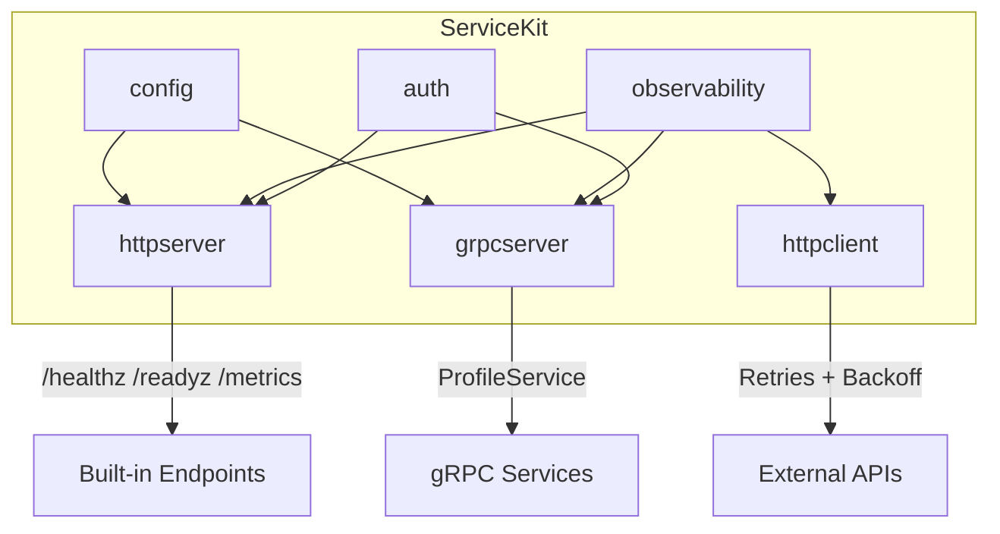

# ServiceKit

[](https://github.com/Zura16/Reusable-Go-Services/actions/workflows/ci.yml)
[](https://zura16.github.io/Reusable-Go-Services/)
[](https://pkg.go.dev/github.com/Zura16/Reusable-Go-Services)
[](https://goreportcard.com/report/github.com/Zura16/Reusable-Go-Services)

A reusable Go service foundation for practicing secure, observable HTTP and gRPC service patterns.

ServiceKit provides typed configuration, HTTP and gRPC server setup, authentication hooks, structured logging, OpenTelemetry tracing, Prometheus metrics, graceful shutdown, and a context-aware HTTP client with exponential backoff and jitter.

🌐 **Live Interactive Playground**: [https://zura16.github.io/Reusable-Go-Services/](https://zura16.github.io/Reusable-Go-Services/)


---

## Quick Start

### Install

```bash
go get github.com/Zura16/Reusable-Go-Services@v0.1.1
```

### Prerequisites

- **Go 1.23+**
- (Optional) `protoc` with `protoc-gen-go` and `protoc-gen-go-grpc` for regenerating proto code

```bash
# Install development tools (protoc plugins + linter)
make tools

# Generate protobuf Go code
make generate
```

### Configure

Set environment variables (all optional — sensible defaults are provided):

```bash
export SERVICEKIT_PORT=8080              # HTTP server port (default: 8080)
export SERVICEKIT_GRPC_PORT=9090         # gRPC server port (default: 9090)
export SERVICEKIT_METRICS_PORT=9091      # Prometheus metrics port (default: 9091)
export SERVICEKIT_SHUTDOWN_TIMEOUT=15s   # Graceful shutdown timeout (default: 15s)
export SERVICEKIT_LOG_LEVEL=info         # Log level: debug|info|warn|error (default: info)
export SERVICEKIT_AUTH_TOKEN=my-secret   # Bearer token for authentication
export SERVICEKIT_ALLOW_INSECURE=true    # Explicitly enable insecure dev mode if token is empty
```

| Variable | Default | Description |
|---|---|---|
| `SERVICEKIT_PORT` | `8080` | HTTP server port |
| `SERVICEKIT_GRPC_PORT` | `9090` | gRPC server port |
| `SERVICEKIT_METRICS_PORT` | `9091` | Prometheus metrics port |
| `SERVICEKIT_SHUTDOWN_TIMEOUT` | `15s` | Graceful shutdown timeout |
| `SERVICEKIT_LOG_LEVEL` | `info` | Minimum log level (debug, info, warn, error) |
| `SERVICEKIT_AUTH_TOKEN` | *(empty)* | Bearer token for authentication |
| `SERVICEKIT_ALLOW_INSECURE` | `false` | Explicitly enables insecure dev mode |

### Run

```go
package main

import (
	"log"
	"net/http"

	"github.com/Zura16/Reusable-Go-Services/config"
	"github.com/Zura16/Reusable-Go-Services/httpserver"
	"github.com/Zura16/Reusable-Go-Services/observability"

	"go.uber.org/zap"
)

func main() {
	cfg, err := config.Load()
	if err != nil {
		log.Fatal(err)
	}

	logger, err := observability.NewLogger(cfg.LogLevel)
	if err != nil {
		log.Fatal(err)
	}
	defer logger.Sync()

	srv, err := httpserver.New(cfg, logger)
	if err != nil {
		log.Fatal(err)
	}

	srv.HandleFunc("GET /hello", func(w http.ResponseWriter, r *http.Request) {
		_, _ = w.Write([]byte("Hello, ServiceKit!"))
	})

	if err := srv.ListenAndServe(); err != nil && err != http.ErrServerClosed {
		logger.Fatal("server stopped with error", zap.Error(err))
	}
}
```

Built-in features:
- `GET /healthz` — liveness probe (returns `200 OK`)
- `GET /readyz` — readiness probe (returns `200` or `503`)
- `GET /metrics` — Prometheus scrape endpoint (isolated on dedicated `MetricsPort` if configured)
- Structured JSON logging with sanitized request IDs
- Panic recovery with JSON error logging and Prometheus counter increments
- Request size limits (`http.MaxBytesReader`)
- Graceful shutdown coordination via context deadlines in application signal handlers

---

## Architecture



---

## Packages

### `config` — Typed Configuration

Loads configuration from environment variables with safe defaults and validation. Secret values (like `AuthToken`) are redacted in `String()` stringifiers.

```go
cfg, err := config.Load()
fmt.Println(cfg)
// Config{Port:8080 ShutdownTimeout:15s LogLevel:info AuthToken:[REDACTED] AllowInsecure:false GRPCPort:9090 MetricsPort:9091}
```

### `observability` — Logging, Metrics & Tracing

**Structured logging** via [zap](https://github.com/uber-go/zap):

```go
logger, _ := observability.NewLogger("info")
logger.Info("request handled", zap.String("method", "GET"), zap.Int("status", 200))
```

**Prometheus metrics** returning registration errors without panicking:

```go
metrics, err := observability.NewMetrics(nil, nil) // uses default registerer & gatherer
```

**OpenTelemetry tracing** with W3C TraceContext propagation:

```go
tp, _ := observability.InitTracer("my-service")
defer observability.ShutdownTracer(context.Background(), tp)
```

### `auth` — Authentication & Authorization

Fail-closed token-based authentication with `ParseBearer(header)`:

```go
validator := auth.NewStaticValidator("my-secret-token", auth.Identity{
    Subject: "admin-user",
    Roles:   []string{"admin"},
})

// HTTP middleware
mux.Handle("/api/v1/protected", auth.HTTPMiddleware(validator)(protectedHandler))

// Role-based authorization
mux.Handle("/admin/", auth.RequireRole("admin")(adminHandler))
```

### `httpserver` — HTTP Server

HTTP server with structured middleware:

```go
srv, _ := httpserver.New(cfg, logger,
    httpserver.WithMetrics(metrics),
    httpserver.WithReadyCheck(func() bool { return dbReady }),
    httpserver.WithMaxBodySize(5 << 20), // 5MB limit
)
```

Default HTTP middleware chain order:
1. **Request ID** (`RequestID`) — generates or validates sanitized `X-Request-ID`
2. **Logging** (`Logging`) — structured JSON request logging with header redaction (`Authorization`, `Cookie`, `Set-Cookie`)
3. **Metrics** (`Metrics`) — Prometheus request counters using Go 1.23 matched route patterns (`r.Pattern`) and histograms
4. **Recovery** (`Recovery`) — catches panics, sets status 500, logged in JSON & recorded in Prometheus
5. **Body limit** (`MaxBodySize`) — enforces request body limits via `http.MaxBytesReader`

### `httpclient` — HTTP Client

Context-aware HTTP client with query parameter logging redaction and body-replay safety:

```go
client := httpclient.New(
    httpclient.WithTimeout(10 * time.Second),
    httpclient.WithLogger(logger),
)
defer client.CloseIdleConnections()

resp, err := client.Get(ctx, "https://api.example.com/data")
```

Retry behavior:
- **Exponential backoff** with jitter and `Retry-After` header parsing (numeric seconds and RFC1123 date formats)
- **URL logging redaction**: logs `host` and `path` without raw query strings to prevent secret leakage
- **Safe by default**: initial attempt uses original body; retry attempts require `GetBody` to replay safely

### `grpcserver` — gRPC Server

gRPC server with complete unary and stream interceptor chains:

```go
grpcSrv, err := grpcserver.New(cfg, logger, validator, metrics,
    grpcserver.WithAuthentication(validator), // or grpcserver.WithInsecureDevelopmentMode()
    grpcserver.WithTLS(tlsConfig),           // optional TLS configuration
)

profilev1.RegisterProfileServiceServer(grpcSrv.Server(), grpcserver.NewProfileServer())
```

Interceptor chain order (unary and streaming):
1. **Logging** → 2. **Metrics** → 3. **OpenTelemetry** → 4. **Recovery** → 5. **Auth**

> **Note on Plaintext/TLS**: By default, servers listen in plaintext TCP mode, suitable when deployed behind a service mesh (Istio, Linkerd) or an ingress controller (Envoy, NGINX). For direct edge exposure, pass `WithTLS(tlsConfig)`.

---

## Example

See [`example/main.go`](example/main.go) for a complete, runnable service wiring up HTTP, dedicated metrics server, and gRPC servers with coordinated graceful shutdown.

```bash
# Explicit local development execution (insecure mode enabled)
SERVICEKIT_ALLOW_INSECURE=true go run ./example/

# Authenticated execution mode
SERVICEKIT_AUTH_TOKEN=secret go run ./example/
```

---

## Benchmarks & Performance

Run performance microbenchmarks:

```bash
make bench
```

**Results (Apple M2)**:
- `auth.StaticValidator`: **32 ns/op** with constant-time equality check and slice copying.
- `auth.HTTPMiddleware`: **Authentication middleware measured 148 ns/op in an isolated microbenchmark on an Apple M2.**

---

## Testing

```bash
# Run all tests with race detector
make test

# View test coverage report
make coverage

# Run benchmarks
make bench
```

---

## License

MIT License — see [LICENSE](LICENSE) for details.
